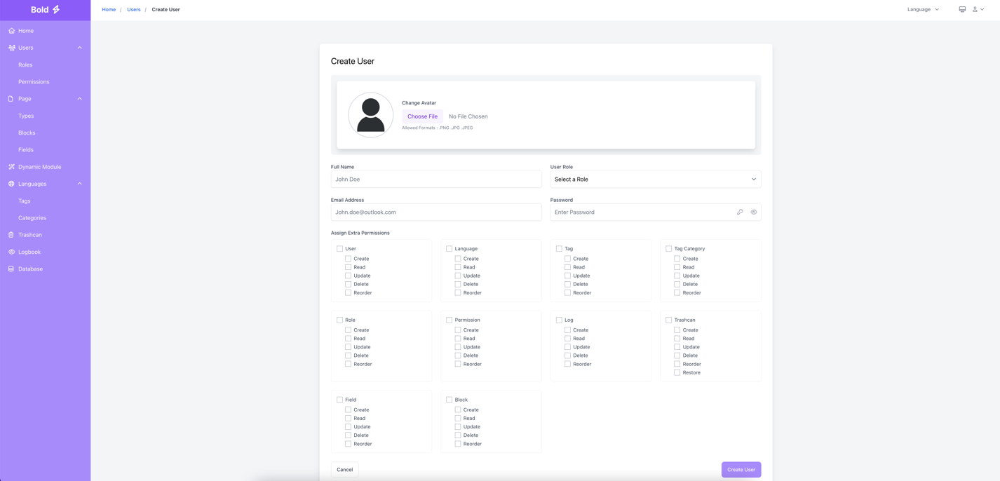
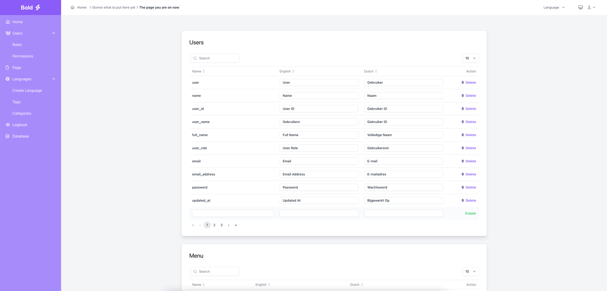
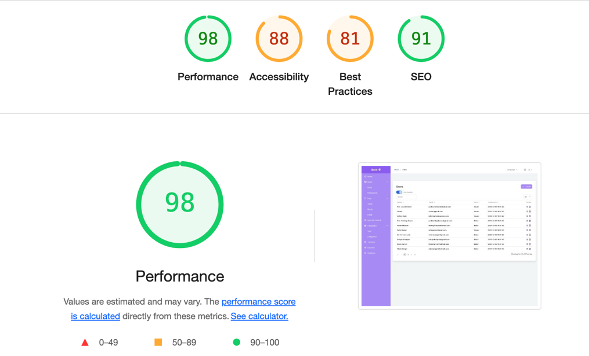

# Lift3 CMS (Internship Project – 2023)

During my third-year internship at [Lift3](https://lift3.nl), I developed a new internal CMS using Laravel
to replace an outdated PHP system. The focus was on backend architecture, maintainability,
and improving the user interface.

### 🛠️ Tech Stack
- Laravel 10  
- PHP 8.2  
- MySQL  
- Blade / Tailwind CSS
  
## Preview
Below are some screenshots of the interface (no internal data).

### 🎬 Demo Lists

---

### 👤 User Management

---

### ⚙️ Logs & Permissions

---

### 📊 Performance Overview

---

**Supervisor:** Pim Arts (Co-Owner, Lift3)
